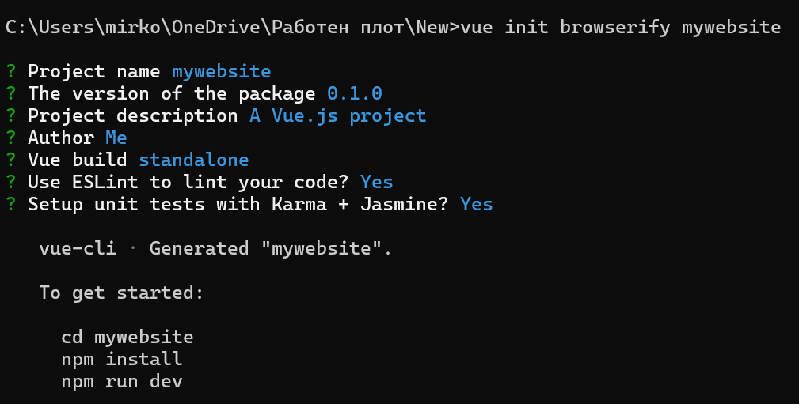
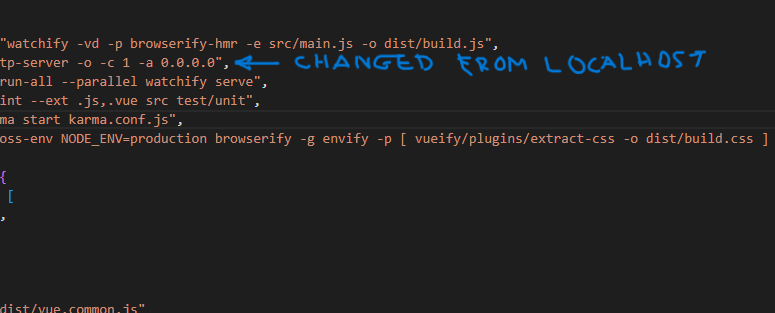
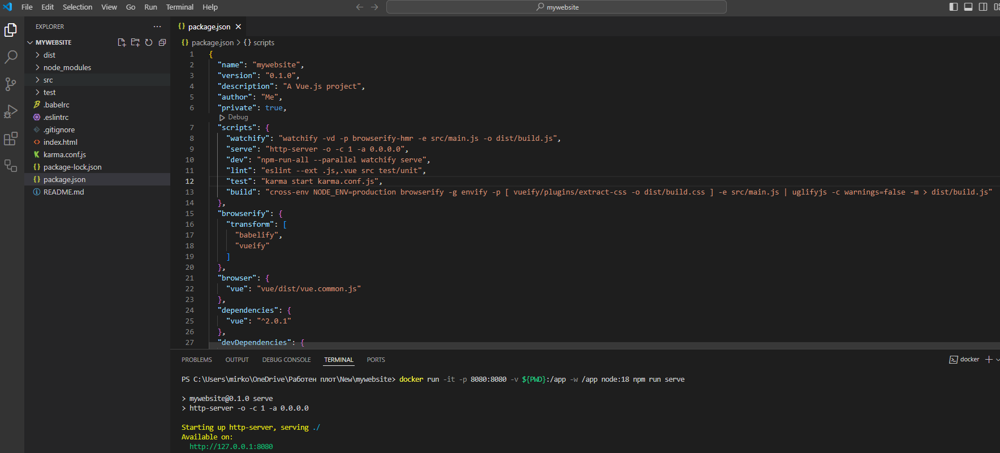
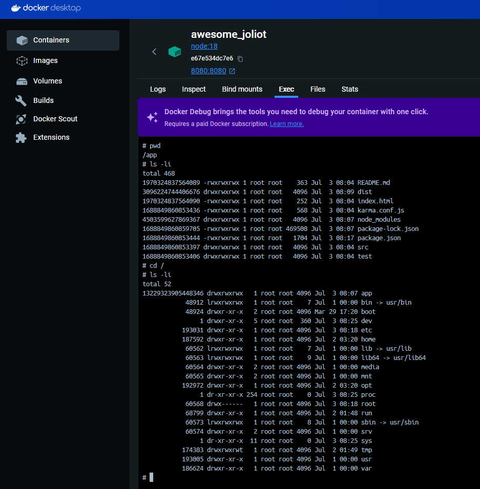

# Docker containers lab 1st exercise

## mywebsite










> A Vue.js project

## Build Setup

``` bash
# install dependencies
npm install

# serve with hot reload at localhost:8080
npm run dev

# build for production with minification
npm run build

# lint all *.js and *.vue files
npm run lint

# run unit tests
npm test
```

For more information see the [docs for vueify](https://github.com/vuejs/vueify).
