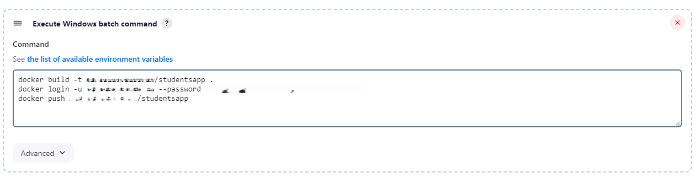

# Softuni Jenkins CI/CD exercise 

## Tasks TODO

1. Create Job CI

2. Add Build and Test steps:  
	- npm install  
	- npm audit  
	- npm test   
	
3. Set Ngrok to serve jenkins server:  
  

4. Add project github webhook (the link from ngrok)  
  

5. Create trigger in Jenkins  
  

6. Build docker image:  
	- Log in Docker  
	- Push to Dockerhub  
	- Add variable for versions to docker  
	- Add user password for docker hub credentials  

  

   

7. Create job CD:  
	- Pull from docker  
	
   

8. Add docker-compose.yml to the project  

9. Post action in the CI to execute the CD if the Ci passes  

10. Fix DockerHub latest version

   

11. Final Jenkins Result

   

   

   
