# DevOps Workshop from 2023

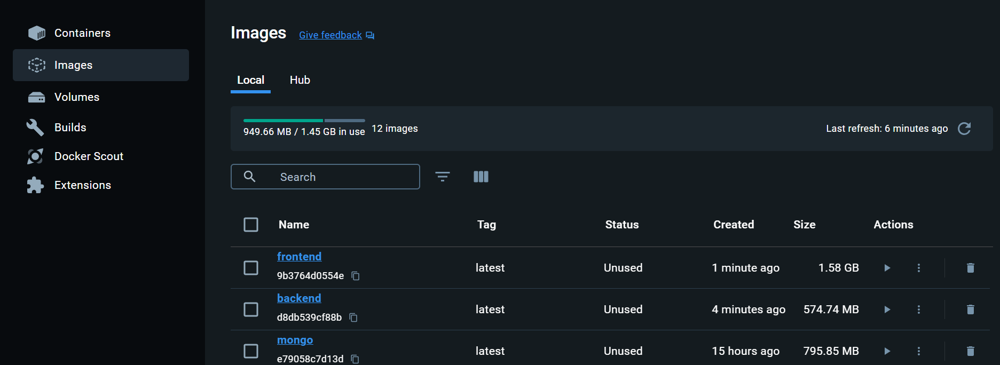

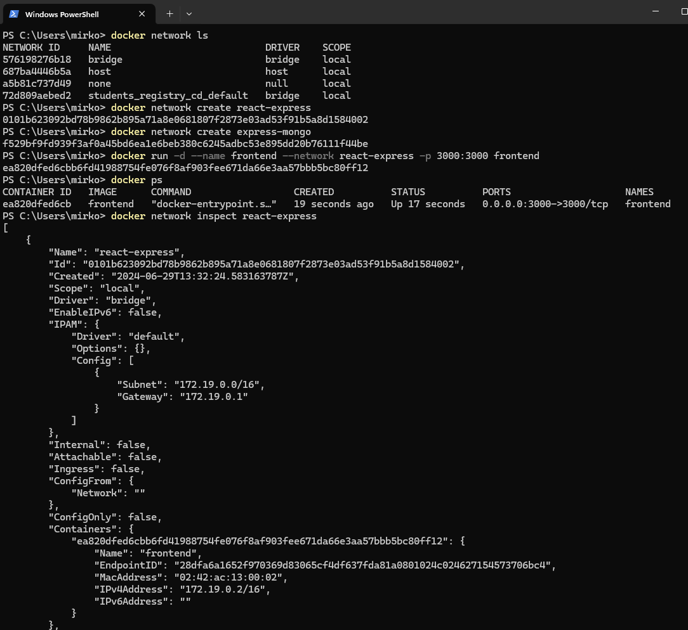

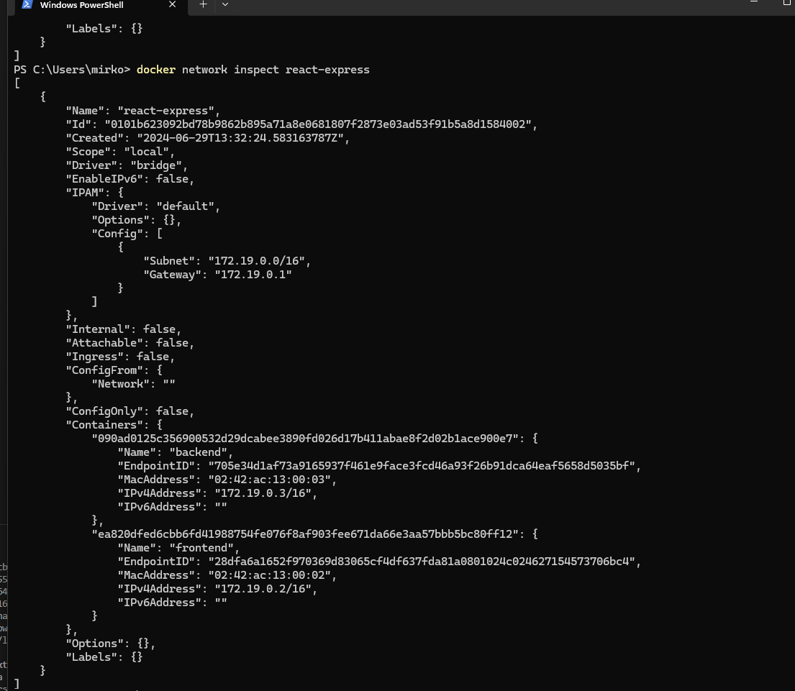

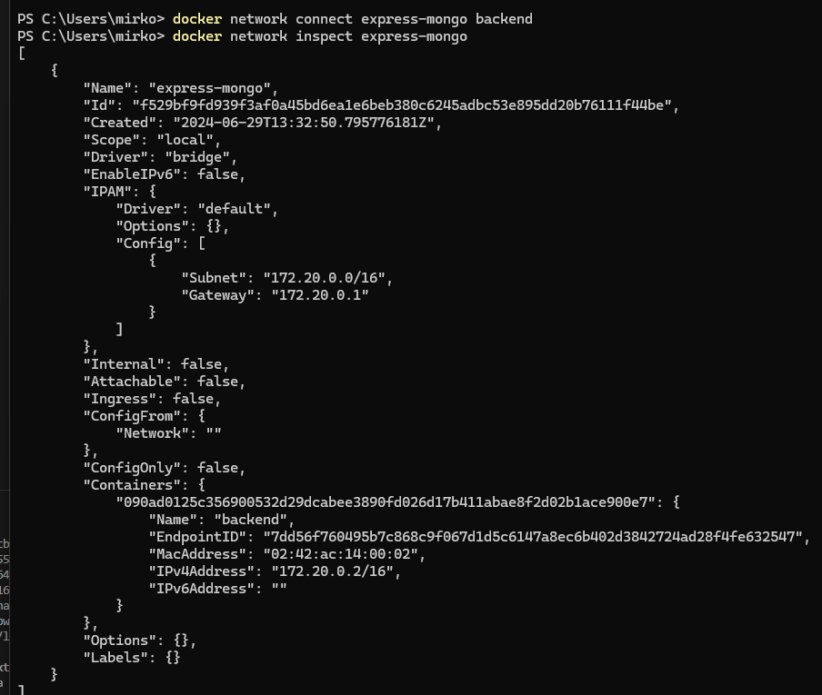

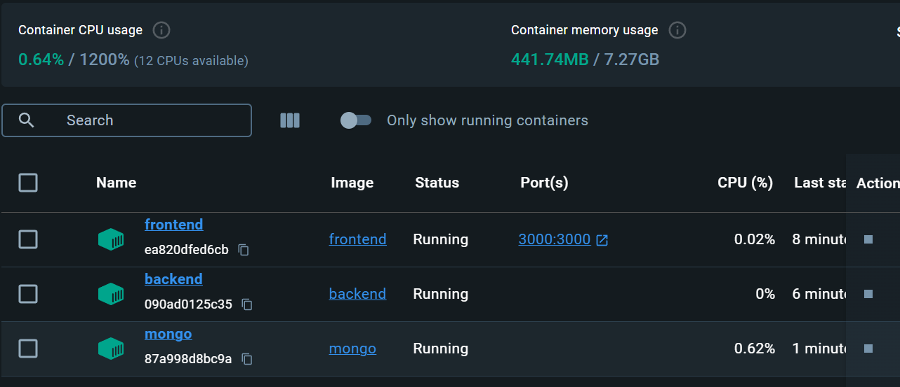

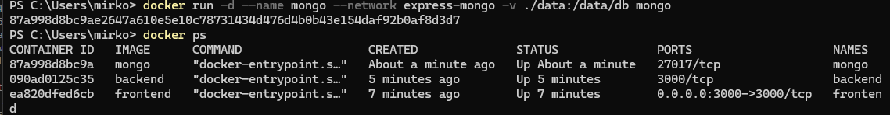

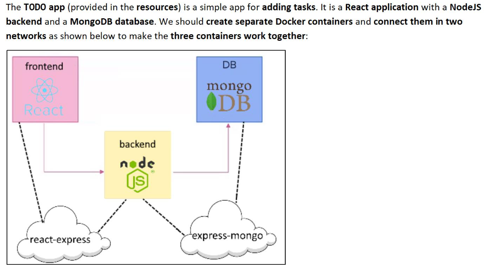

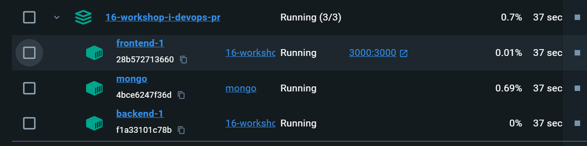

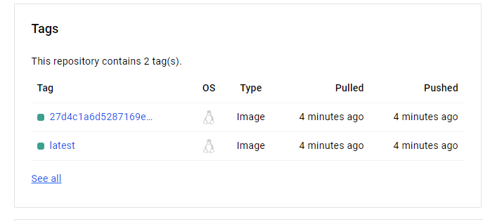

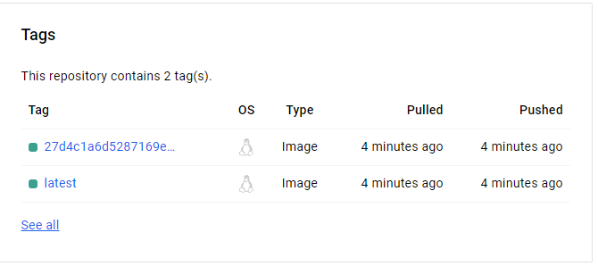

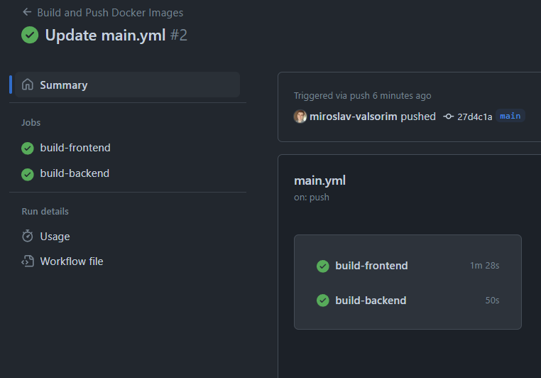

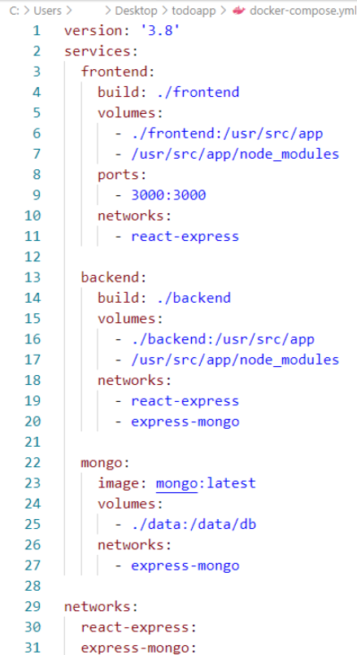

1.  
	- cd backend  
	- docker build -t backend .  

2.   
	- cd..  
	- cd frontend  
	- docker build -t frontend .  

3.  
	- docker pull mongo  

4.  
	- docker network ls  

5.  
	- docker network create react-express  

6.  
	- docker network create express-mongo  

7. start frontend from docker  
	- docker run -d --name frontend --network react-express -p 3000:3000 frontend  

8. start backend from docker  
	- docker run -d --name backend --network react-express backend  

9. create folder 'data' in the project   

10. start mongo db  
	- docker run -d --name mongo --network express-mongo -v .\data:/data/db mongo  
	- (also would work) docker run -d --name mongo --network express-mongo mongo  

11. 
	- docker network connect express-mongo backend  

12. create docker-compose.yml  
	- https://www.composerize.com/	 

13.  
	- (containers and images should be deleted before that)  
	- test docker-compose.yml  
	- docker-compose build  
	- docker-compose up -d  
	
14. Set Github env secrets for DockerHub

15. build pipeline